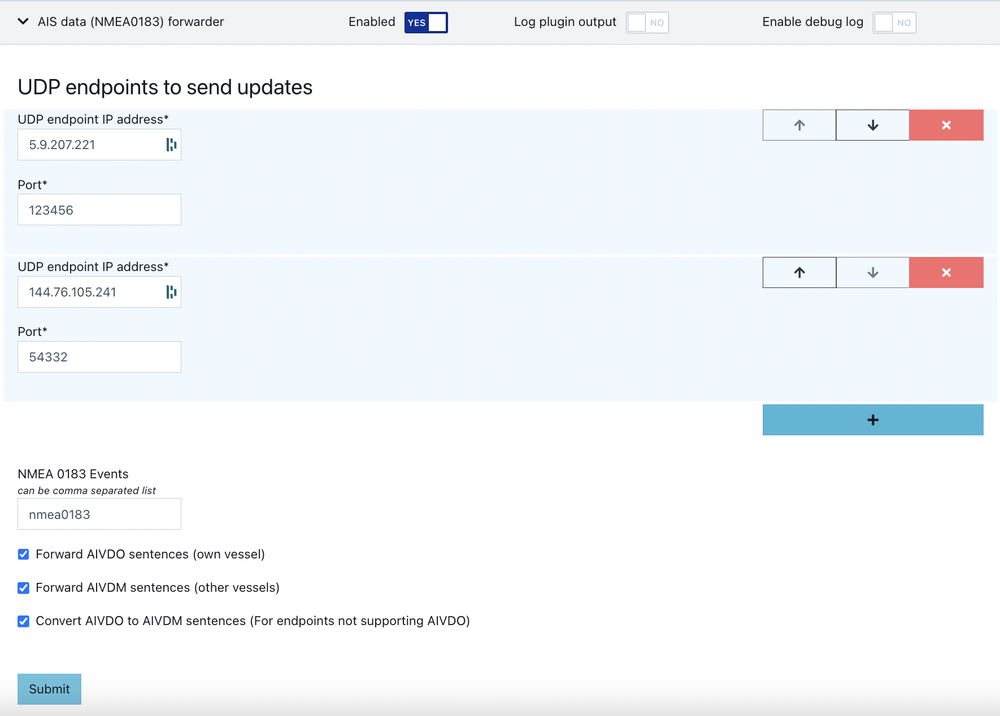

# ais-forwarder

[Signal K Node server](https://github.com/SignalK/signalk-server-node) plugin to forward [NMEA0183 AIS messages](https://gpsd.gitlab.io/gpsd/AIVDM.html) over UDP. This enables your vessel to double as a [MarineTraffic roaming station](https://help.marinetraffic.com/hc/en-us/articles/205282657-Add-an-AIS-Receiving-Station-to-the-MarineTraffic-Network), [AISHub Station](https://www.aishub.net/) or both.

This plugin can also be used with NMEA 2K AIS receivers by converting the data first to NMEA 0183 format for example with [signalk-n2kais-to-nmea0183 plugin](https://github.com/sbender9/signalk-n2kais-to-nmea0183). In this case `nmea0183out` must be used as an NMEA 0183 Event in the ais-forwarder plugin configuration.

Output can be debugged with `nc -ulkw 0 <ipaddress> <port>`.
